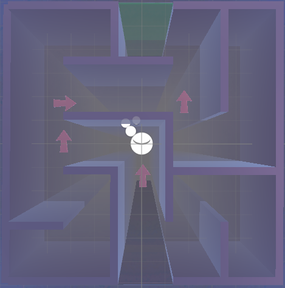
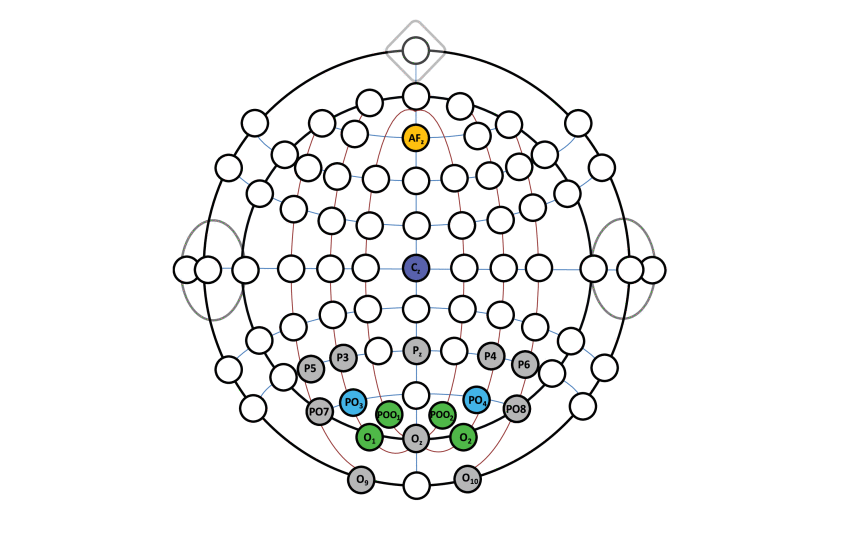
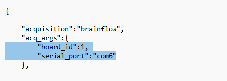

# What is this
***video*** 



A VR maze that is navigated using an SSVEP-based BCI system.

# Start
## EEG Setup

If using the OpenBCI Ganglion, you can follow the setup guide here: [OpenBCI Ganglion Setup Guide](https://docs.openbci.com/GettingStarted/Boards/GanglionGS/).\
NOTE: You won't need the OpenBCI GUI for this game, but feel free to use it to ensure the EEG is working. 
\\

Place electrodes as shown in the image, following the 10-20 system. For more information, see the [paper](https://ieeexplore.ieee.org/document/8914280) on optimal electrode placements for an SSVEP-based BCI system.

Ensure EEG device is connected to your computer and note the port number (on Windows, go to Device Manager).

---

## Starting the BCI System

1. Clone the repository:  
   ```bash
   git clone https://github.com/mindaffect/pymindaffectBCI
   ```

2. Move the cloned repo inside the VRMaze directory. 

3. In the `pymindaffectBCI/mindaffectBCI` directory, locate the `noisetag_bci.json` file. Edit the `board_id` according to the [BrainFlow documentation](https://brainflow.readthedocs.io/en/stable/UserAPI.html?highlight=board%20id#brainflow-board-shim) and update the serial port to match the port you're using. \
NOTE: the default board id is set to the Ganglion board (`board_id = 1`) and the port to `com6`.



4. Inside the `pymindaffectBCI` directory, run `start_bci.bat`. In the popup, select the `noisetag_bci.json` file as your config file.
   ```bash
   start_bci.bat
   ```
* If for any reason the bat file doesn't work, you can do it manually:\
&nbsp;&nbsp;&nbsp;&nbsp;&nbsp;&nbsp;1. From inside the `pymindaffectBCI` directory, open one terminal and run UtopiaHub
```bash
python3 -m mindaffectBCI.decoder.startUtopiaHub 
```
&nbsp;&nbsp;&nbsp;&nbsp;&nbsp;&nbsp;2. In another terminal, run the following command and select the noisetag_bci.json file as your config file.
```bash
python3 -m mindaffectBCI.online_bci
```

5. Two new terminal windows should pop up. Ensure the message is as follows. Leave them running in the background.

   ***insert pic of terminal windows and explain each***

___

## Starting the Game

Clone this repo. Then, open the game using Unity Hub (last tested on `2022.3.37f1` engine). Connect VR device to computer and start the game on Unity. 

If using MetaQuest, ensure MetaQuest PC app is downloaded on computer. On VR device, connect using QuestLink. 


# Instructions

Focus on the flashing arrow to navigate your way through the maze. Right and left turn 90 degrees in their respective directions. Straight goes forward. The arrow you choose turns green. Arrows disappear for 2 seconds after each choice.
***diagram of arrows***

# References 

[unitymindaffectBCI](https://github.com/mindaffect/unitymindaffectBCI)\
[pymindaffectBCI](https://github.com/mindaffect/pymindaffectBCI)


